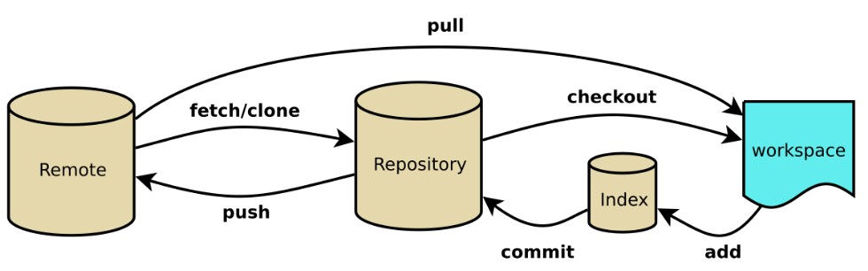
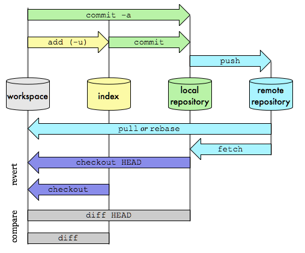
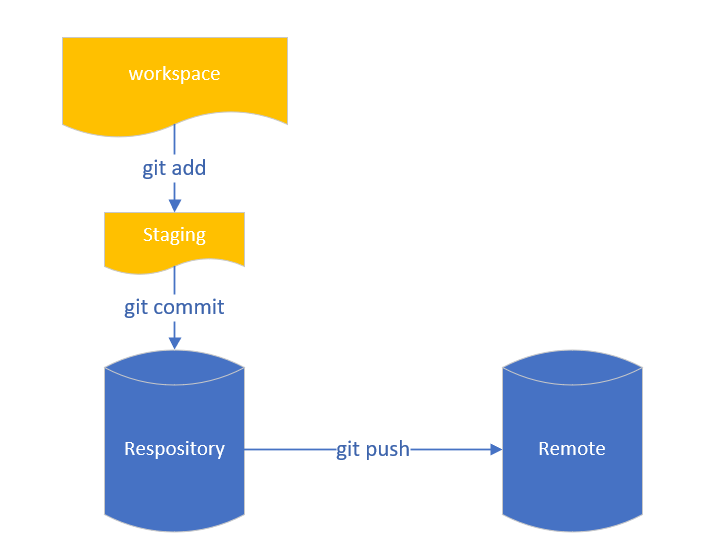
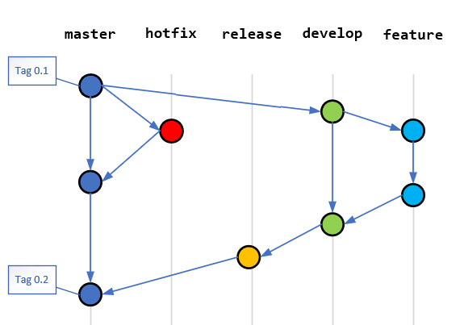
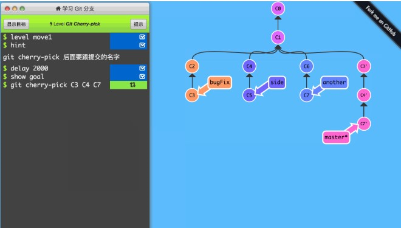
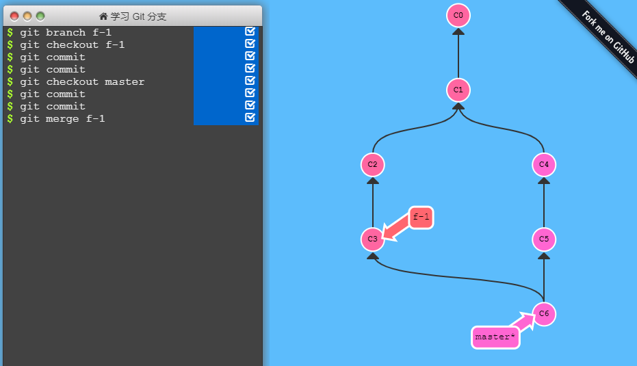
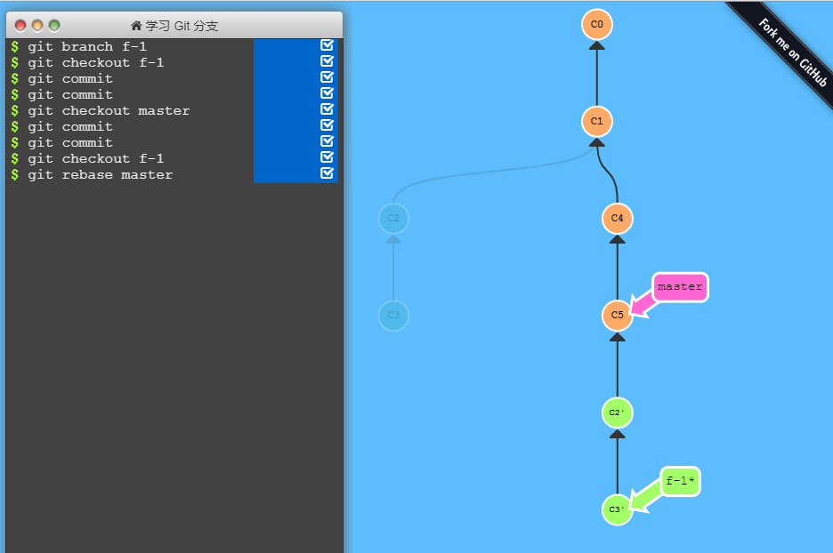

# Git Flow

---

## 0. Git 的基本概念

Git 主要有四块存储区域：

-   Workspace：工作区
-   Index / Stage：暂存区
-   Repository：仓库区（或本地仓库）
-   Remote：远程仓库

工作区是本地计算机存储，平时项目代码存储的地方。暂存区也是在本地存储，当你在修改代码但是还没有执行 commit 操作时临时存放你的改动，事实上它只是一个文件，保存即将提交到文件列表信息。仓库区就是本地版本库，这里面有你提交到所有版本的数据。其中 HEAD 指向最新放入仓库的版本。远程仓库就是比如 GitLab 或者 Github 等。

### 命令之 add & commit & push

add & commit 实际上就是一个文件加入版本控制的过程，在受 git 管理的目录下新建一个文件，首先要将它标记为*add*，接下来*commit*到本地的仓库，就完成了本地的版本管理。之后可以选择是否执行 push 操作，如果执行就是将本地的变更提交到远程服务器上，这样别人就可以获取到你的更新了。

### 命令之 branch & checkout

branch 是常见的创建分支应用的语法，git 和传统的 cs 模式的 SCM 的工具相比 branch 的代价是非常小的，影响也是非常小的。git 的 branch 可以只存在与本地，轻易和合并与删除。左图就是很多 Flow 流程中可能存在的多个分支（实际上这些分支本地和远程都是存在的）。我们本地的一个项目可能就会存在多个分支，我们使用 checkout 命令，签出一个分支之后，环境中的文件都会变为该分支的相关文件。

### 命令之 cherry-pick

pick 是挑选的意思，我们看一下示意图。这是要求将 bugFix 分支上的 C3 、side 分支上的 C4 以及 another 分支上的 C7 通过 cherry-pick 的形式拿到 master 分支上。这是很典型的一个使用 cherry-pick 的场景，bug 修复的合并。

### 命令之 merge & rebase

通过上面的 branch 和 push，我们已经切出不同的分支并且提交了，接下来就是要合并我们的提交内容到主分支上，这时我们可能会面临两个命令选择 merge 和 rebase。这两个命令有什么区别呢？我们通过一个模拟界面来看一下：

merge: 

rebase: 

场景描述：从 master 切出 feature-1 分支，master 新增了提交 c1、c2，同时 feature-1 新增了提交 c3、c4，这时候 feature-1 不应该尝试直接 merge 提交至 master，而是应该从 master 进行 rebase，将 c1、c2 同步到 feature-1 分支。这样当需要和 master 合并时就不会有差异需要合并，能够将差异提前消除。

建议： rebase 会把你当前分支的 commit 放到公共分支的最后面,所以叫变基。就好像你从公共分支又重新拉出来这个分支一样。 merge 会把公共分支和你当前的 commit 合并在一起，形成一个新的 commit 提交。为什么建议使用 rebase，因为通常我们是 feature 分支基于 master 分支进行 rebase，master 是长期固定分支，feature 是临时分支，我们不希望因为临时分支的变更影响到 master 分支的提交记录，而且通常情况下 master 分支是锁定不允许直接提交的。所以建议大家使用 rebase，这样能够在不影响 master 分支的情况下还能够合并最新的内容。

## 1. Git Flow 整体流程图

## 2. 主要分支

Flow 中包含 2 个主要分支

**master**：这个分支代表着生产环境的发布版本。

**develop**：这个分支代表着开发人员为下一个发布版本提交的最新代码。

当源码在 develop 分支中被开发完成，并准备发布时，所有的提交变更都应该会合并至 master 分支，并使用 tag 工具标记一个版本号。

## 3. 辅助分支

Flow 中包含 3 个辅助分支辅助分支用于支持团队成员并行开发，包括新功能开发、生产发布准备、生产环境问题修复。和主要分支不同，辅助分支一般只在需要时建立，生命周期结束后即被释放删除。

**feature**： 特性分支。

**release**： 发布分支。

**hotfix**： 维护分支。

## 4. 功能性分支

特性分支（也叫新功能分支）被⽤用于即将开发的或更长期的功能开发。特性分支在该功能开发过程中存在，当开发完毕后，被合并至 develop 分支，完成其生命周期。

分支来源：develop

分支合并目标：develop

分支命名规范： 任何名字，但不要使用   master, develop, release-_  或  hotfix-_

功能分支的规范：feature/\*

特性分支可以只在开发人员的仓库中存在，不需要在 origin 中被创建。

## 5. 发布分支

发布分支用于新版本发布前的准备工作。它允许我们在发布前，做最后一点点改动，包括少量 BUG 的修改、元数据（如版本信息、编译参数等）的修改等。当所有工作完成后， develop 分支再将这些修改全部合并回来，开始下一个版本的开发工作。

分支来源：develop

分⽀支合并目标： develop 和  master

分⽀支命名规范 : release-\*

发布分支命名规范：release/\*

## 6. 维护分支

维护分支（也叫 Bug 修复分支）和发布分支相似，但它并不是计划中的⼯工作。它应用于生产环境中出现的紧急 Bug 修复。维护分支基于线上运行的 Tag 号签出，并以此为基础进行修改。

分支来源：master

分支合并目标： develop 和  master

分支命名规范：hotfix-\*

维护分支的命名规范：hotfix/\*

如果此时已经创建了一个发布分支，正准备下一次上线工作，则维护分支应该被合并至该发布分支，而不是 develop 分支。紧急修复的代码将在发布分支完成时，经由发布分支合并至 develop 分支中(如果 develop 分支也需要立即使用这个紧急修复的代码，则也可以将维护分支同时合并在 develop 中）。

## 7. Git Flow 规范示例

1. **创建 develop 分支** git branch develop git push -u origin develop
2. **开始新 Feature 开发** git checkout -b some-feature develop

    // 分支不一定需要被推送至远端 git push -u origin some-feature

    // 做一些改动 git status git add some-file git commit

3. **完成 Feature** git pull origin develop git checkout develop git merge --no-ff some-feature git push origin develop

    git branch -d some-feature

    // # 如果需要推送至远端 git push origin --delete some-feature

4. **开始 Release** git checkout -b release-0.1.0 develop
5. **完成 Release** git checkout master git merge --no-ff release-0.1.0 git push

    git checkout develop git merge --no-ff release-0.1.0 git push

    git branch -d release-0.1.0

    // # If you pushed branch to origin: git push origin --delete release-0.1.0

    git tag -a v0.1.0 master git push --tags

6. **始 Hotfix** git checkout -b hotfix-0.1.1 master
7. **完成 Hotfix** git checkout master git merge --no-ff hotfix-0.1.1 git push

    git checkout develop git merge --no-ff hotfix-0.1.1 git push

    git branch -d hotfix-0.1.1

    git tag -a v0.1.1 master git push --tags

## 8. 在 VSCode 中如何走 Git Flow 流程

安装 GitFlow 这个插件

## 9. Code Review

-   [ ] 等待编写

---

[返回 README](../README.md)
